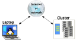
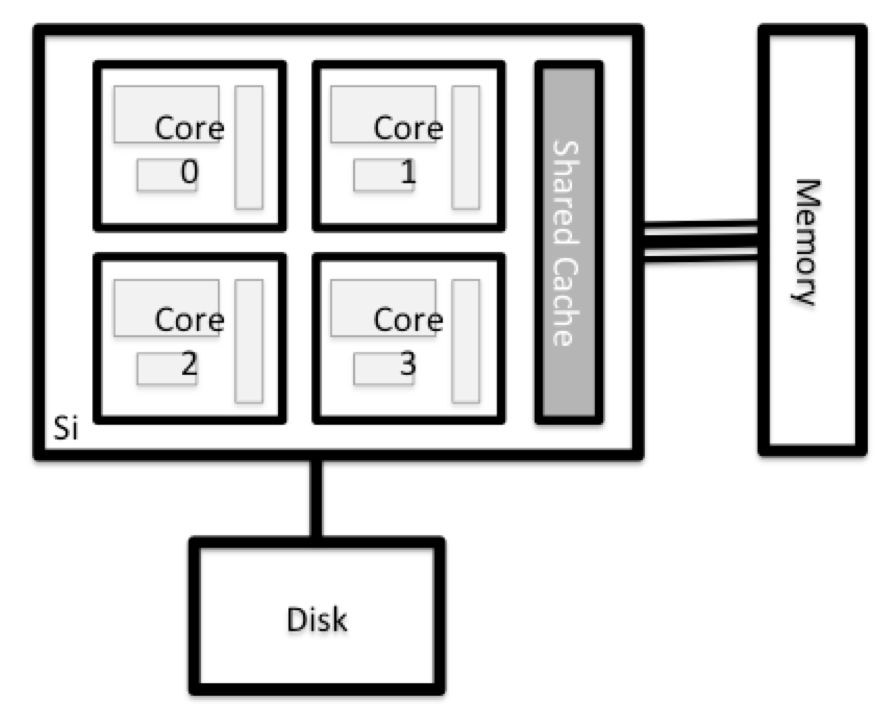

```{r, echo=FALSE}
# Source the external configuration script
source("load_config.R")
```

::: questions
- "¿Qué es un sistema HPC?"
- "¿Cómo funciona un sistema HPC?"
- "¿Cómo inicio sesión en un sistema HPC remoto?"
:::

::: objectives
- "Conectarse a un sistema HPC remoto."
- "Comprender la arquitectura general de un sistema HPC."
:::

## ¿Qué es un sistema HPC?

Las palabras "nube", "clúster" y la frase "computación de alto rendimiento" o
"HPC" se usan mucho en distintos contextos y con varios significados
relacionados. Entonces, ¿qué significan? Y más importante, ¿cómo las usamos en
nuestro trabajo?

La *nube* es un término genérico que suele referirse a recursos de cómputo que
a) se *aprovisionan* a las personas usuarias bajo demanda o según necesidad y
b) representan recursos reales o *virtuales* que pueden estar ubicados en
cualquier lugar del mundo. Por ejemplo, una empresa grande con recursos de
cómputo en Brasil, Zimbabue y Japón puede gestionar esos recursos como su nube
*interna* y esa misma empresa puede también utilizar recursos de nube
comerciales provistos por Amazon o Google. Los recursos de nube pueden referirse
a máquinas que realizan tareas relativamente simples como servir sitios web,
proporcionar almacenamiento compartido, ofrecer servicios web (como correo
electrónico o plataformas de redes sociales), así como tareas de cómputo más
intensivas como ejecutar una simulación.

El término *sistema HPC*, por otro lado, describe un recurso independiente para
cargas de trabajo computacionalmente intensivas. Por lo general están compuestos
por una multitud de elementos integrados de procesamiento y almacenamiento,
diseñados para manejar grandes volúmenes de datos y/o un gran número de
operaciones de punto flotante
([FLOPS](https://en.wikipedia.org/wiki/FLOPS)) con el mayor rendimiento posible.
Por ejemplo, todas las máquinas de la lista
[Top-500](https://www.top500.org) son sistemas HPC. Para cumplir estas
restricciones, un recurso HPC debe existir en una ubicación específica y fija:
los cables de red solo pueden extenderse hasta cierto punto, y las señales
eléctricas y ópticas solo pueden viajar a cierta velocidad.

La palabra "clúster" se usa a menudo para recursos HPC de escala pequeña a
moderada, menos impresionantes que el [Top-500](https://www.top500.org).
Los clústeres suelen mantenerse en centros de cómputo que soportan varios
sistemas de este tipo, todos compartiendo red y almacenamiento comunes para
apoyar tareas de cómputo intensivas.

## Iniciar sesión

El primer paso para usar un clúster es establecer una conexión desde nuestra
laptop al clúster. Cuando estamos sentados frente a una computadora (o de pie,
o sosteniéndola en las manos o en la muñeca), esperamos una pantalla visual con
iconos, widgets y quizá algunas ventanas o aplicaciones: una interfaz gráfica
de usuario, o GUI. Como los clústeres de computadoras son recursos remotos a
los que nos conectamos mediante interfaces a menudo lentas o con retraso
(especialmente WiFi y VPN), es más práctico usar una interfaz de línea de
comandos, o CLI, en la que comandos y resultados se transmiten solo como texto.
Cualquier cosa distinta al texto (por ejemplo, imágenes) debe escribirse en
disco y abrirse con un programa separado.

Si alguna vez has abierto el Símbolo del Sistema de Windows o la Terminal de
macOS, has visto una CLI. Si ya tomaste los cursos de The Carpentries sobre la
Shell de UNIX o Control de Versiones, has usado la CLI en tu máquina local de
manera relativamente extensa. El único salto aquí es abrir una CLI en una
máquina *remota*, tomando algunas precauciones para que otras personas en la red
no puedan ver (o cambiar) los comandos que estás ejecutando o los resultados que
la máquina remota devuelve. Usaremos el protocolo Secure SHell (o SSH) para
abrir una conexión de red cifrada entre dos máquinas, permitiéndote enviar y
recibir texto y datos sin preocuparte por ojos curiosos.

{alt="Conectarse al clúster"}

Asegúrate de tener un cliente SSH instalado en tu laptop. Consulta la sección
de [configuración](../index.md) para más detalles. Los clientes SSH suelen ser
herramientas de línea de comandos, donde proporcionas la dirección de la máquina
remota como el único argumento obligatorio. Si tu nombre de usuario en el
sistema remoto difiere del que usas localmente, también debes proporcionarlo. Si
tu cliente SSH tiene una interfaz gráfica, como PuTTY o MobaXterm, configurarás
estos argumentos antes de hacer clic en "connect". Desde la terminal, escribirás
algo como `ssh userName@hostname`, donde el símbolo "@" se usa para separar las
dos partes de un mismo argumento.

Abre tu terminal o cliente SSH gráfico y luego inicia sesión en el clúster
usando tu nombre de usuario y la computadora remota a la que puedes acceder
desde el exterior, `r config$remote$location`.

```bash
`r config$local$prompt` ssh `r config$remote$user`@`r config$remote$login`
```

Recuerda reemplazar ``r config$remote$user`` por tu nombre de usuario o el
proporcionado por las personas instructoras. Puede que se te pida la contraseña.
Cuidado: los caracteres que escribes después del mensaje de contraseña no se
muestran en la pantalla. La salida normal se reanudará una vez que presiones
`Enter`.

## ¿Dónde estamos?

A menudo, muchas personas tienden a pensar en una instalación de cómputo de alto
rendimiento como una sola máquina gigante y mágica. A veces, se asume que la
computadora en la que iniciaron sesión es todo el clúster. Entonces, ¿qué está
pasando realmente? ¿A qué computadora nos conectamos? El nombre de la
computadora actual se puede comprobar con el comando `hostname`. (¡Puede que
notes que el hostname actual también forma parte de nuestro prompt!)

```bash
`r config$remote$prompt` hostname
```

```output
`r config$remote$host`
```

::: challenge

## ¿Qué hay en tu directorio personal?

Las personas administradoras del sistema pueden haber configurado tu directorio
personal con algunos archivos, carpetas y enlaces (accesos directos) útiles a
espacios reservados para ti en otros sistemas de archivos. Echa un vistazo y
mira qué puedes encontrar.
*Pista:* Los comandos de shell `pwd` y `ls` pueden ser útiles.
El contenido del directorio personal varía de una persona a otra. Comenta con
tus vecinos cualquier diferencia que notes.

:::: solution

## Es un día hermoso en el vecindario

La capa más profunda debería diferir: ``r config$remote$user`` es solo tuyo.
¿Hay diferencias en la ruta en niveles superiores?

Si ambos tienen directorios vacíos, se verán idénticos. Si tú o tu vecino han
usado el sistema antes, puede haber diferencias. ¿En qué están trabajando?

Usa `pwd` para **p**rintar la ruta del **d**irectorio de trabajo:

```bash
`r config$remote$prompt` pwd
```

Puedes ejecutar `ls` para **l**i**s**tar el contenido del directorio, aunque es
posible que no se muestre nada (si no se han proporcionado archivos). Para
asegurarte, usa la opción `-a` para mostrar también los archivos ocultos.

```bash
`r config$remote$prompt` ls -a
```

Como mínimo, esto mostrará el directorio actual como `.`, y el directorio padre
como `..`.

::::
:::

## Nodos

Las computadoras individuales que componen un clúster suelen llamarse *nodos*
(aunque también escucharás que las llaman *servidores*, *computadoras* y
*máquinas*). En un clúster hay distintos tipos de nodos para diferentes tareas.
El nodo en el que estás ahora se llama *nodo principal*, *nodo de acceso*, o
 *nodo de envío*. Un nodo de acceso sirve como punto
de entrada al clúster.

Como puerta de enlace, es adecuado para subir y descargar archivos, configurar
software y ejecutar pruebas rápidas. En general, el nodo de acceso no debe
usarse para tareas que consuman mucho tiempo o recursos. Debes estar atento a
esto y consultar con el personal operador o la documentación de tu sitio para
detalles de lo que está o no permitido. En estas lecciones evitaremos ejecutar
trabajos en el nodo principal.

::: callout

## Nodos dedicados para transferencia

Si quieres transferir grandes cantidades de datos hacia o desde el clúster,
algunos sistemas ofrecen nodos dedicados solo para transferencias. La razón es
que transferencias grandes no deberían obstaculizar el funcionamiento del nodo
de acceso para el resto. Consulta la documentación de tu clúster o su equipo de
soporte para saber si hay un nodo de transferencia disponible. Como regla
general, considera grandes todas las transferencias de más de 500 MB a 1 GB.
Pero estos números cambian, por ejemplo, según la conexión de red tuya y del
clúster u otros factores.
:::

El trabajo real en un clúster lo realizan los *nodos de trabajo* (o *nodos de
cómputo*). Los nodos de trabajo vienen en muchas formas y tamaños, pero en
general están dedicados a tareas largas o difíciles que requieren muchos
recursos de cómputo.

Toda interacción con los nodos de trabajo es manejada por un software
especializado llamado planificador, gestor de colas o *scheduler* (el planificador usado en esta lección se
llama **`r config$sched$name`**). Más adelante aprenderemos a usar el
planificador para enviar trabajos, pero por ahora también puede darnos más
información sobre los nodos de trabajo.

Por ejemplo, podemos ver todos los nodos de trabajo ejecutando el comando
``r config$sched$info``.

```bash
`r config$remote$prompt` `r config$sched$info`
```

```{r, echo=FALSE, results='asis'}
snippets('cluster/queue-info.Rmd')
```

También hay máquinas especializadas que se usan para gestionar almacenamiento en
disco, autenticación de usuarios y otras tareas de infraestructura. Aunque no
solemos iniciar sesión ni interactuar directamente con estas máquinas, permiten
funciones clave como asegurar que nuestra cuenta de usuario y archivos estén
disponibles en todo el sistema HPC.

## ¿Qué hay en un nodo?

Todos los nodos en un sistema HPC tienen los mismos componentes que tu laptop o
escritorio: *CPU* (a veces también llamadas *procesadores* o *núcleos*),
*memoria* (o *RAM*) y espacio en *disco*. Las CPU son la herramienta de la
computadora para ejecutar programas y cálculos. La información sobre una tarea
actual se almacena en la memoria de la computadora. El disco se refiere a todo
almacenamiento al que se puede acceder como sistema de archivos. Por lo general
es almacenamiento que puede guardar datos de forma permanente, es decir, los
datos siguen ahí incluso si la computadora se reinicia. Aunque este almacenamiento
puede ser local (un disco duro instalado dentro del equipo), es más común que
los nodos se conecten a un servidor de archivos compartido y remoto o a un
clúster de servidores.

{max-width="20%" alt="Anatomía del nodo" caption=""}

::: challenge

## Explora tu computadora

Intenta averiguar la cantidad de CPU y la memoria disponible en tu computadora
personal.
Ten en cuenta que, si estás conectado al clúster remoto, primero debes cerrar
sesión. Para hacerlo, escribe `Ctrl+d` o `exit`:

```bash
`r config$remote$prompt` exit
`r config$local$prompt`
```

:::: solution

Hay varias maneras de hacer esto. La mayoría de los sistemas operativos tiene un
monitor del sistema gráfico, como el Administrador de tareas de Windows. A
veces se puede encontrar información más detallada en la línea de comandos. Por
ejemplo, algunos de los comandos usados en un sistema Linux son:

Ejecuta utilidades del sistema

```bash
`r config$local$prompt` nproc --all
`r config$local$prompt` free -m
```

Lee desde `/proc`

```bash
`r config$local$prompt` cat /proc/cpuinfo
`r config$local$prompt` cat /proc/meminfo
```

Usa un monitor del sistema

```bash
`r config$local$prompt` htop
```

::::
:::

::: challenge

## Explora el nodo de acceso

Ahora compara los recursos de tu computadora con los del nodo de acceso.

:::: solution

```bash
`r config$local$prompt` ssh `r config$remote$user`@`r config$remote$login`
`r config$remote$prompt` nproc --all
`r config$remote$prompt` free -m
```

Puedes obtener más información sobre los procesadores usando `lscpu`,
y muchos detalles sobre la memoria leyendo el archivo `/proc/meminfo`:

```bash
`r config$remote$prompt` less /proc/meminfo
```

También puedes explorar los sistemas de archivos disponibles usando `df` para
mostrar el espacio **l**ibre en **d**isco. La opción `-h` muestra los tamaños
en un formato legible, es decir, GB en lugar de B. La opción de **t**ipo `-T`
indica qué tipo de sistema de archivos es cada recurso.

```bash
`r config$remote$prompt` df -Th
```
::::
:::

::: discussion
Los sistemas de archivos locales (ext, tmp, xfs, zfs) dependerán de si estás en
el mismo nodo de acceso (o nodo de cómputo, más adelante). Los sistemas de
archivos en red (beegfs, cifs, gpfs, nfs, pvfs) serán similares, pero pueden
incluir `r config$remote$user`, dependiendo de cómo esté [montado](
https://en.wikipedia.org/wiki/Mount_(computing)).
:::

::: callout
## Sistemas de archivos compartidos

Este es un punto importante para recordar: los archivos guardados en un nodo
(computadora) a menudo están disponibles en todo el clúster.

:::

```{r, echo=FALSE, results='asis'}
snippets('cluster/specific-node-info.Rmd')
```

::: discussion
## Compara tu computadora, el nodo de acceso y el nodo de cómputo
Compara el número de procesadores y la memoria de tu laptop con los números que
ves en el nodo principal del clúster y el nodo de trabajo. Comenta las
diferencias con tu vecino.

¿Qué implicaciones crees que podrían tener esas diferencias al ejecutar tu
trabajo de investigación en los distintos sistemas y nodos?
:::

::: callout
## Diferencias entre nodos

Muchos clústeres HPC tienen una variedad de nodos optimizados para cargas de
trabajo particulares. Algunos nodos pueden tener mayor cantidad de memoria, o
recursos especializados como Unidades de Procesamiento Gráfico (GPU).
:::

Con todo esto en mente, ahora veremos cómo hablar con el planificador del
clúster y usarlo para empezar a ejecutar nuestros scripts y programas.

::: keypoints
 - "Un sistema HPC es un conjunto de máquinas conectadas en red."
 - "Los sistemas HPC normalmente proporcionan nodos de acceso y un conjunto de nodos de trabajo."
 - "Los recursos en nodos independientes (de trabajo) pueden variar en volumen y
   tipo (cantidad de RAM, arquitectura del procesador, disponibilidad de sistemas
   de archivos montados en red, etc.)."
 - "Los archivos guardados en un nodo están disponibles en todos los nodos."
:::
